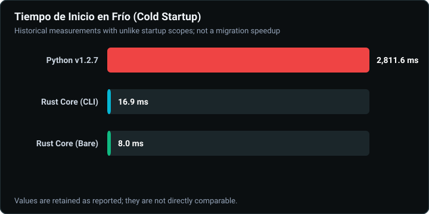
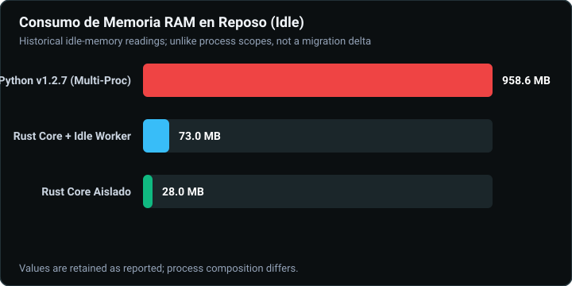
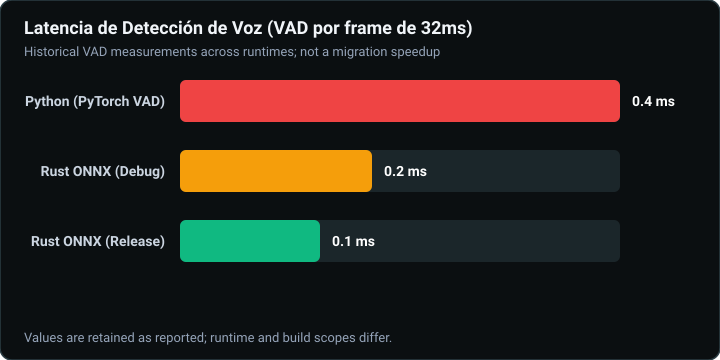
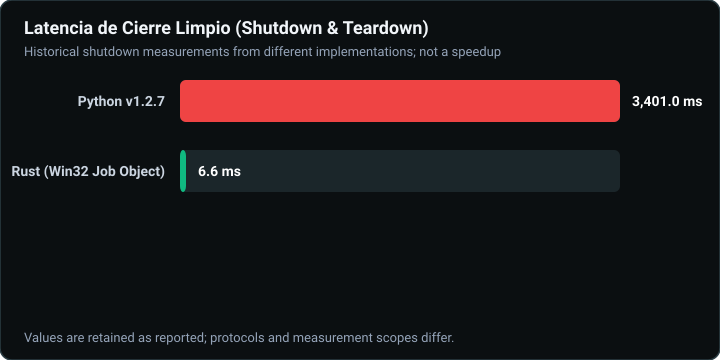
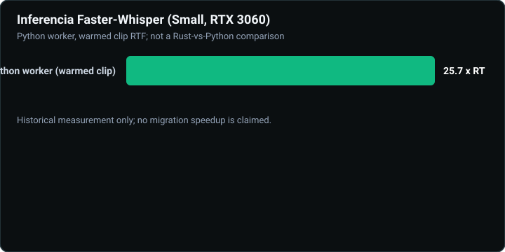

# Plynte LiveAudio

[](LICENSE)
[](https://www.rust-lang.org/)
[](https://tauri.app/)
[](https://www.python.org/)
[](https://github.com/plynte-labs/LiveAudio)

LiveAudio is a real-time automatic speech recognition (ASR) engine designed for streamers and content creators. It captures audio from your microphone or system, transcribes it locally using **Whisper** (OpenAI), and sends subtitles to **OBS Studio** via **WebSocket**.

**100% local processing — nothing is sent to the cloud. Python old v1.2.7**


***Rust Migration Tauri UI v1.5.0***


---

## Features

- **Rust Core & Native Audio Pipeline (v1.5.0):** Ultra-low-latency audio capture via CPAL (physical mic or WASAPI Loopback on Windows) and high-speed Silero VAD powered by ONNX Runtime in native Rust.
- **Tauri 2 Desktop:** Bilingual two-column interface with Setup, Subtitles, Advanced, and Files settings, a live subtitle preview, and accessible confirmation dialogs.
- **Faster-Whisper Worker Supervision:** Python ASR engine isolated in a supervised child process with Win32 Job Objects (zero orphan/zombie processes) and automatic recovery.
- **Configurable VAD Chunks up to 60s:** Extended speech buffer support with dynamic sample pre-roll and real-time streaming inference.
- **Idempotent Real-Time State Control:** Instant UI feedback with thread-safe transition locking preventing duplicate clicks or race conditions.
- **Unified Language Profiles & Dynamic Switching:** Automatic context switching of prompt guidelines and anti-hallucination blacklists according to active transcription language (`es` / `en`).
- **OBS Studio Subtitle Overlay:** Multi-theme HTML browser source via local WebSocket broadcast (`default`, `karaoke`, `neon`, `minimal`, `bold`, `rgb`, `typewriter`) with backlog anti-burst protection.
- **Complete Session Persistence:** Sanitized `.jsonl` transcript and `.vtt` subtitles saved automatically to chosen session directory.

---

## Performance & Migration Benchmarks (Rust Core v1.5.0 vs Python v1.2.7)

LiveAudio v1.5.0 shifts performance-critical operations (audio acquisition, VAD frame evaluation, WebSocket broadcasting, and process supervision) to a native **Rust workspace with Tauri 2**, retaining Faster-Whisper inside an isolated, supervised worker.

> **Detailed documentation:** [Historical Benchmark Report (WU9)](docs/migration/wu9_benchmark_comparison_report.md) · [Architecture Specification (WU1)](docs/migration/architecture_wu1.md)

### 1. Cold Startup Latency


- **Python v1.2.7:** ~2,811.6 ms
- **Rust Core (CLI):** 16.9 ms
- **Rust Core (Bare):** 8.0 ms *(~166x speedup)*

### 2. Resident Memory Footprint (Idle)


- **Python v1.2.7 Multi-process:** ~958.6 MB
- **Rust Core + Idle Worker:** ~73.0 MB *(~13.1x reduction)*
- **Rust Core Isolated:** ~28.0 MB

### 3. Voice Activity Detection (Silero VAD 32ms Frame Latency)


- **Python (PyTorch VAD):** 0.358 ms
- **Rust ONNX (Release):** 0.114 ms *(~3.1x faster frame evaluation)*

### 4. Clean Shutdown & Teardown Latency


- **Python v1.2.7:** 3,401.0 ms
- **Rust Core (Win32 Job Object):** 6.6 ms *(Guaranteed clean termination, 0 zombies)*

### 5. ASR Real-Time Throughput


- **Rust CPU Fallback (int8):** 2.99x Real-Time
- **Rust CUDA (float16):** 25.74x Real-Time (Faster-Whisper `small` on RTX 3060)

---

## System Requirements

| Component | Recommended |
|---|---|
| **OS** | Windows 10/11 (WASAPI Loopback) or Linux x86_64 |
| **Python** | Not required for end-users — bundled in portable release |
| **GPU** | NVIDIA with CUDA (optional but recommended for larger models) |
| **RAM** | 8 GB minimum, 16 GB recommended |
| **Disk** | ~400 MB (CPU) / ~2.5 GB (CUDA) for app + dependencies, plus model cache |
| **Microphone** | Any audio input device or WASAPI loopback |
| **Internet** | Required on first run only (model download from Hugging Face / GitHub) |

### Running in a Virtual Machine

LiveAudio works in VMs with the following considerations:

| VM setup | Result |
|---|---|
| VM without GPU passthrough (VirtualBox, VMware default) | ✅ Works on CPU — functional for testing |
| VM with GPU passthrough (VMware vGPU, Proxmox) | ✅ Works with CUDA acceleration |
| Cloud VM without GPU (EC2, GCP) | ✅ CPU only — suitable for headless testing |
| VM without audio device exposed to guest | ❌ Expose virtual audio host adapter first |

---

## Installation & Development

### Prerequisites
- **Rust:** 1.80+ (2021 edition)
- **Node.js:** 18+ (for frontend testing and Tauri tools)
- **Python:** 3.11 with [uv](https://docs.astral.sh/uv/)

### Setup & Run
```bash
# Clone the repository
git clone https://github.com/plynte-labs/LiveAudio.git
cd LiveAudio

# Setup Python worker venv (CUDA 12.1 or CPU)
uv sync --extra cu121   # or: uv sync --extra cpu

# Run the Tauri Desktop App (Development)
cargo run -p liveaudio-desktop

# Run Headless CLI Service
cargo run -p liveaudio-cli -- --help

# Run Test Suites
cargo test --workspace
node desktop/test_frontend.js
.venv\Scripts\pytest tests/test_asr_worker_ipc.py
```

### Packaging for Virtual Machines & Clean Environments
To generate a self-contained portable distribution package (`.zip`) with bundled Python runtime, CUDA/cuDNN DLLs, and binaries ready to test in a clean VM:

```bash
python packaging/package_tauri_release.py --package-portable --release
```

---

## Project Structure

```
LiveAudio/
├── crates/
│   ├── liveaudio-audio/      # CPAL audio capture (Mic & WASAPI Loopback)
│   ├── liveaudio-vad/        # Silero VAD (ONNX Runtime engine)
│   ├── liveaudio-ipc/        # Typed JSON lines IPC protocol
│   ├── liveaudio-core/       # App state, config persistence, supervision
│   ├── liveaudio-network/    # Tokio WebSocket broadcast server
│   └── liveaudio-cli/        # Headless CLI service
├── desktop/
│   ├── src-tauri/            # Tauri 2 backend (Rust commands, event bus)
│   └── src/                  # Vanilla frontend (HTML, CSS, JS, i18n, modals)
├── liveaudio/
│   ├── service/              # Faster-Whisper Python worker runtime
│   └── assets/               # OBS subtitle HTML overlays
├── docs/
│   └── migration/            # Migration architecture, reports & SVG charts
├── packaging/
│   ├── package_tauri_release.py # Portable VM packaging script
│   └── generate_comparison_charts.py # SVG benchmark chart generator
└── Cargo.toml                # Rust workspace definition
```

---

## Main Dependencies

| Library | Version | Purpose |
|---|---|---|
| `faster-whisper` | >=1.0.0,<2.0.0 | Optimized Whisper transcription |
| `torch` | >=2.0,<2.7 (CPU) / >=2.4,<2.6 (CUDA 12.1) | Inference backend |
| `sounddevice` | >=0.4.6,<0.5.0 | Real-time audio capture |
| `numpy` | >=1.24.0,<2.1.0 | Audio buffer manipulation |
| `customtkinter` | >=5.2.0,<6.0.0 | Modern GUI |
| `Pillow` | >=10.0.0,<12.0.0 | Image processing for branding/UI |
| `websockets` | >=14.0,<17.0 | WebSocket server for OBS |

---

## Configuration

On first run, a `config.json` file is created automatically with default values in the data home (see locations above). You can modify all settings from the GUI or by editing `config.json` directly.

```json
{
    "output_dir": "<absolute_path>/sessions",
    "device": "cuda",
    "cpu_threads": 8,
    "model_size": "small (Balance CPU)",
    "blacklist": "amara.org, subtitulos por, suscribete, dale like, gracias por ver",
    "continuous_session": true,
    "subtitle_style": "default",
    "subtitle_backlog_policy": "auto",
    "subtitle_max_live_delay_sec": 10.0,
    "subtitle_catchup_interval_sec": 1.5,
    "silence_timeout": 0.8,
    "max_chunk_duration": 5.0,
    "asr_decode_timeout_sec": 15,
    "audio_device": null,
    "selected_profile_id": "balanced",
    "ws_port": 8765,
    "obs_enabled": true,
    "asr_language": "es",
    "diagnostics_enabled": false
}
```

---

## Basic Usage

1. Start LiveAudio (the installed launcher, or `uv run liveaudio` from a checkout).
2. On the welcome screen, choose the folder where sessions will be saved.
3. In the settings panel:
   - Choose a **profile** (`Fast`, `Balanced`, `Quality`, or `Stable Streaming`) to start without manual tuning.
   - Select your **audio device** (microphone or system loopback).
   - Choose **CPU** or **CUDA** depending on your hardware.
   - Select the **model size** (`tiny`, `base`, `small`, `turbo`).
   - Press **Apply changes** to activate and save settings.
4. Press **START SYSTEM**.
5. Open `liveaudio/assets/subtitulos_obs.html` as a **Browser Source** in OBS (see [docs/WEBSOCKET_OBS.md](docs/WEBSOCKET_OBS.md)).

---

## Configuration Profiles

Choose the output purpose separately from the hardware profile. Hardware presets do not change the selected purpose or phrase window. Longer transcript windows improve phrase continuity but delay final subtitle output; the combined option prioritizes the transcript rather than promising low-latency subtitles.

Profiles are built-in presets to avoid manually tuning every sensitive control.

| Profile | Recommended for |
|---|---|
| `Fast` | Lower latency and short phrases; slightly lower accuracy. |
| `Balanced` | Recommended for most sessions. |
| `Quality` | Higher accuracy; may use more VRAM and take longer. |
| `Stable Streaming` | Reduces GPU load for gaming or streaming on a busy PC. |

If you modify a built-in profile, LiveAudio treats it as `Custom`. Changes are pending until you press **Apply changes**.

---

## OBS Backlog Policy

LiveAudio always saves valid transcriptions to the session (`transcript.jsonl` and `subtitles.vtt`). The **OBS Delay** option only controls what is shown live in OBS when the ASR falls behind due to a busy GPU/CPU, full VRAM, or a temporary freeze.

| Mode | Behavior |
|---|---|
| `Auto` | Sends fresh subtitles. Short backlogs are emitted with pacing. If delay exceeds `subtitle_max_live_delay_sec`, they are saved but not shown in OBS. |
| `Live only` | Saves everything, but only shows subtitles within the configured max delay in OBS. |
| `Send all` | Sends everything to OBS even if it arrives late. Useful if you prefer full visual fidelity over avoiding bursts. After a long freeze the replay buffer is bounded (256 messages, drop-oldest) so the live edge is preserved. |

---

## Headless service mode (integrators)

LiveAudio can run as a **headless backend with no window**, spawned by an owner process (e.g. opencohost):

```bash
liveaudio-service --parent-pid <PID> [--health-file <path>]
```

> **Supported entry point:** on an installed Windows build, `liveaudio-service` (console script) is the ONLY supported headless path. The installed `liveaudio` GUI executable has no console/stdout, so `liveaudio --service ...` only works from a source checkout in a terminal — it is a dev convenience, not the integration contract.

- **Process ownership:** the service lives until the owner dies (parent-PID watchdog, Windows + POSIX, machine-local PIDs only). There is no TCP control plane. Only one service instance runs per data home (stale locks are reclaimed).
- **Lazy ASR:** the supervisor and WebSocket start immediately; audio/ASR load only on the first WS client. Before that the service reports `asr_state: unavailable` (≈ `stt_unreachable`).
- **Config snapshot:** the service reads the CTK-saved config read-only and never writes `config.json`. Changing settings requires restarting the service (no hot reload).
- **Port discovery:** same `base..base+9` fallback as the GUI (10 candidates from `ws_port`); the effective port is announced via `hello.port`, the `ws_port` stdout event, and health. Never assume a fixed port.
- **Health:** versioned JSON lines on stdout (`service_state`, `ws_port`, `asr_state`, `fatal`) plus an optional atomic health-file snapshot. No transcripts, audio, logs, or private paths are ever emitted.
- **Backlog bound:** `send_all` replays at most the last 256 subtitles (drop-oldest) after a freeze — the live edge, not the full history.
- **Glossary:** *base port* = configured `ws_port`; *effective port* = port actually bound; *scope* = saved `save_transcript`/`save_vtt`/`obs_enabled`/`ws_port`/backlog settings the service obeys; *dueño-por-proceso* = single owner process via watchdog.
- **Known limitation:** parent-PID checks are TOCTOU against OS PID reuse — if the owner dies and its PID is reassigned before the next 1 s poll, the service briefly considers the parent alive. A new owner cannot adopt it anyway (instance lock rejects a second service).

> **Note:** reader-side auto-discovery lives in the VoiceAI unit (`feature/liveaudio-service-client`), AFTER this LiveAudio unit. Suggested order: LiveAudio first, VoiceAI second. This track ships the LiveAudio side only.

## First-use model download: states, codes, times

On a clean machine the ASR pill (GUI) and `asr_state` (service) are honest about
Whisper provisioning instead of a generic loading spinner:

| State | What it means | What to do |
|---|---|---|
| `downloading N%` | Model downloading with real progress (0–100, monotonic per attempt) | Wait; `N%` never moves backward except on manual retry |
| `downloading…` | Downloading but progress unparseable (indeterminate fallback) | Wait; never a frozen 0% |
| `loading` / `transcribing` | Model loading / warming up | Wait |
| `stalled` | 120–180 s with zero events/progress | Press **Retry** (new attempt, `%` restarts once, then monotonic) |
| `ready` | Model loaded | Stream |
| `failed` + code | Provisioning failed (see codes below) | Follow the one-line hint, then Retry |

Failure codes (`provision-*`, one-line remediation, no tracebacks in UI):

| Code | Remediation |
|---|---|
| `model-not-found` (real absence only) | Check the model name and retry |
| `provision-cache-corrupt` | Retry to re-download |
| `provision-network` | Check your network and retry |
| `provision-auth` | Check credentials and retry |
| `provision-disk-full` | Free disk space and retry |
| `provision-timeout-stalled` | Download took too long — retry |
| `provision-tls` | Secure connection failed — retry |
| `provision-unknown` | Unexpected error while preparing the model |

Expected first-download sizes (time ∝ your connection; rough guide at ~50 Mbps:
`tiny` ~150 MB ≈ 30 s · `base` ~300 MB ≈ 1 min · `small` ~480 MB ≈ 1.5 min ·
`turbo` ~1.5 GB ≈ 4–5 min · Silero VAD ~2 MB ≈ instant). After that the app works
fully offline. Service integrators: `asr_state_legacy` collapses these to
`loading/ready/failed` for OpenCohost compat; a manual retry is a new `attempt`.

---

## Troubleshooting

| Symptom | Possible cause | Solution |
|---|---|---|
| Nothing is transcribed | Wrong audio device | Verify the correct microphone or loopback is selected in the UI. |
| Very high latency | Model too large on CPU | Switch to `tiny` or `base`, or use GPU. |
| OBS shows no subtitles | WebSocket not connected | Make sure LiveAudio is running and the HTML points to `ws://127.0.0.1:8765`. |
| CUDA error | Outdated drivers | Update NVIDIA drivers or switch to CPU in settings. |
| Zombie processes on close | Abrupt shutdown | Always use the **STOP SYSTEM** button before closing the window. |

---

## Local Diagnostics

LiveAudio includes **local-first** diagnostics for maintenance. Nothing is sent to any external service.

### What they measure

- Visible state of `audio`, `asr`, `ws` processes
- Queue sizes visible from the UI
- Pipeline latencies and instrumented states
- Backpressure, reconnect, and timeout signals

### Configuration

| Key | Value | Description |
|---|---|---|
| `diagnostics_enabled` | `true/false` | Enables local instrumentation |
| `diagnostics_level` | `minimal` / `deep` | Controls how much local context is saved |
| `diagnostics_export_dir` | path or `null` | Preferred folder for exporting reports |

Press **Export diagnostics** in the main UI to generate a local JSON report.

---

## Contributing

## Unified first-run experience

The current checkpoint is aligning installation and first model preparation
around one ES/EN checklist: installation selection, uv, LiveAudio code,
dependencies, opening the app, VAD, Whisper, and ready to start. The handoff
and phase vocabulary are present, but the full unified UX is not closed: clean
packaged runtime, review, VM, and manual evidence remain pending. The launcher
percentage fix is recorded; indeterminate work must never use a simulated
percentage.

The candidate includes VAD `provision-network`, `provision-tls`, and
`provision-cache-corrupt` remediation and a conservative retry boundary. Full
VAD/supervisor integration and no-burst behavior still require supported-runtime
and manual evidence. No OBS subtitle should be sent during provisioning recovery.

Contributions are welcome! Please read [CONTRIBUTING.md](CONTRIBUTING.md) before opening a pull request.

- [Bug Report](https://github.com/plynte-labs/LiveAudio/issues/new?template=bug_report.yml)
- [Feature Request](https://github.com/plynte-labs/LiveAudio/issues/new?template=feature_request.yml)
- [Security Vulnerability](SECURITY.md) — report privately, do not open a public issue

Please follow our [Code of Conduct](CODE_OF_CONDUCT.md).

---

## License

Distributed under the MIT License. See [LICENSE](LICENSE) for details.

---

## Credits

- [Tauri](https://tauri.app/)
- [OpenAI Whisper](https://github.com/openai/whisper)
- [Faster Whisper](https://github.com/SYSTRAN/faster-whisper)
- [Silero VAD](https://github.com/snakers4/silero-vad)
- [ONNX Runtime](https://onnxruntime.ai/)
- [CPAL (Cross-Platform Audio Library)](https://github.com/RustAudio/cpal)
- [CustomTkinter](https://github.com/TomSchimansky/CustomTkinter)
