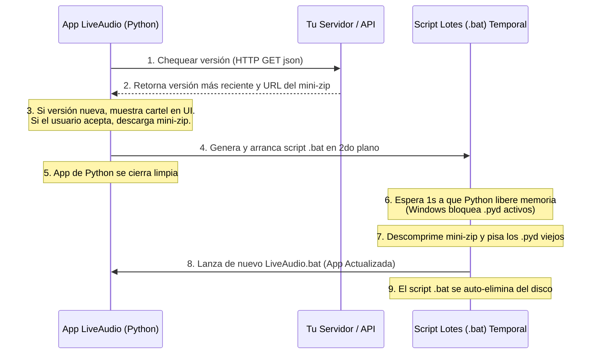

# Guía de Empaquetado, Seguridad y Actualizaciones de LiveAudio

Este documento centraliza el diseño arquitectónico, las decisiones de seguridad y la estrategia de distribución/actualización de **LiveAudio** para Windows.

---

## 1. Decisiones de Arquitectura

### 1.1 Python Portable Embebido (Alternativa B) vs. PyInstaller
Se seleccionó la distribución de **Python Embeddable** oficial junto a un script constructor (`build_portable.py`) en lugar de compiladores monolíticos como PyInstaller:
* **Entorno Determinista**: Garantiza que la app siempre corra sobre la versión exacta de Python (3.10.11) y con las dependencias congeladas en `Lib/site-packages/`.
* **Evita Conflictos Dinámicos**: PyInstaller suele fallar al importar librerías complejas nativas (como `sounddevice` o `customtkinter` y sus archivos JSON de temas). El entorno portable resuelve esto nativamente.
* **Sin descompresión lenta**: Los ejecutables de un solo archivo (`--onefile` de PyInstaller) tardan minutos en abrir en apps con PyTorch (3-5 GB) porque deben extraer dependencias en la carpeta temporal de Windows. El entorno portable arranca al instante.

### 1.2 Captura Manos Libres (VAD Continuo) vs. Push-to-Talk (PTT)
* **Decisión**: Mantener **VAD Continuo** (detección por Silero VAD) como el único motor de captura, descartando explícitamente PTT.
* **Motivación**: Un streamer jugando en vivo no puede estar presionando una tecla física constantemente mientras juega para subtitularse. La automatización manos libres es el corazón del UX del producto.
* **Optimización**: El callback de audio en C copia los bytes de forma ultrarrápida al `ring_buffer` (deque thread-safe) y un hilo secundario procesa el VAD en CPU, aislando la inferencia y absorbiendo picos de latencia.

---

## 2. Blindaje de Propiedad Intelectual (make_private.py)

Para transformar la app portable en un producto comercial de código cerrado, se implementa una compilación híbrida usando **Nuitka**:

```text
Lógica Propietaria (.py) ──▶ [ Nuitka (MSVC/MinGW64) ] ──▶ Código Nativo C ──▶ Binario Nativo (.pyd)
```

### 2.1 El Truco de Entrada (Entrypoint Bootstrap)
Python no puede ejecutar un binario `.pyd` directamente como entrypoint (ej: `python.exe main.pyd` falla). Lo resolvemos mediante una estructura elegante:
1. Renombramos `main.py` (interfaz y carga de perfiles) a `app_main.py`.
2. Compilamos `app_main.py` a `app_main.pyd` con Nuitka y borramos el `.py` original.
3. Creamos un cargador transparente plano `main.py` con una sola línea de código: `import app_main`.
4. El cargador plano inicia el binario cifrado de forma invisible. Los accesos directos `.bat` siguen funcionando sin cambios.

### 2.2 Análisis de Seguridad e Ingeniería Inversa
> [!IMPORTANT]
> **PyInstaller es vulnerable**: Un hacker puede extraer tu código fuente Python en texto plano en 5 segundos usando herramientas como `pyinstxtractor` sobre un ejecutable empaquetado.

* **Blindaje con Nuitka (.pyd)**: Nuitka es un compilador real. Traduce tu lógica Python a C y luego a binario nativo (DLLs de Windows). El código Python original en texto plano es destruido. Lo que queda en el disco del usuario es **código de máquina nativo**.
* **Resiliencia ante Inteligencia Artificial Local / Nube**:
  * Un hacker puede intentar descompilar el `.pyd` en pseudo-código C usando desensambladores como *Ghidra* o *IDA Pro*.
  * Si el hacker le da una pequeña función descompilada a un LLM (como una Llama 3 local potente o GPT-4o), la IA puede llegar a deducir qué hace y reescribir esa función matemática en Python.
  * **La barrera a gran escala**: Nuitka inyecta miles de líneas de "plomería" interna de la C-API de Python (control del GIL, conteo de referencias `Py_INCREF`/`Py_DECREF`, etc.) para hacer correr Python en C. Para una IA, entender toda esa masa gigante de bajo nivel y reconstruir la arquitectura de archivos del proyecto entero sin alucinar y romper todo es **técnicamente imposible**.
  * Al hacker le resultará infinitamente más fácil escribir la app de cero que intentar reconstruir tu IP con IA. El nivel de seguridad es equivalente a una app escrita en C++ o Rust.

---

## 3. Estrategia de Actualización de Software (Updates)

### 3.1 Actualización Manual Ultraliviana
Dado que PyTorch (2.7 GB) y las dependencias no cambian, tu código propietario apenas pesa unos kilobytes.
* **Flujo**: Volvés a compilar `make_private.py` en tu PC de desarrollo. Distribuís a tus usuarios un mini-ZIP (de 1 MB) que solo contenga los `.pyd` actualizados (`core/audio.pyd`, `core/engine.pyd`, `app_main.pyd`). El usuario los extrae en su carpeta existente de LiveAudio pisando los anteriores.

### 3.2 Actualizador Automático (Auto-updater integrado)
Para implementar un actualizador de un solo clic desde la UI de CustomTkinter:



---

## 4. Guía de Ejecución Rápida

Para empaquetar y privatizar LiveAudio:

1. **Generar la estructura portátil base**:
   ```powershell
   python build_portable.py
   ```
   *(Elegí la Opción 1 para soporte GPU CUDA, u Opción 2 para CPU-only).*

2. **Privatizar y compilar el código propietario**:
   ```powershell
   python make_private.py
   ```
   *(Nuitka compilará tu lógica a `.pyd` y eliminará los archivos de texto plano `.py` legibles).*

3. **Distribuir**:
   Comprimí la carpeta `dist/LiveAudio/` en un archivo `.zip` y subilo a tu servidor.
