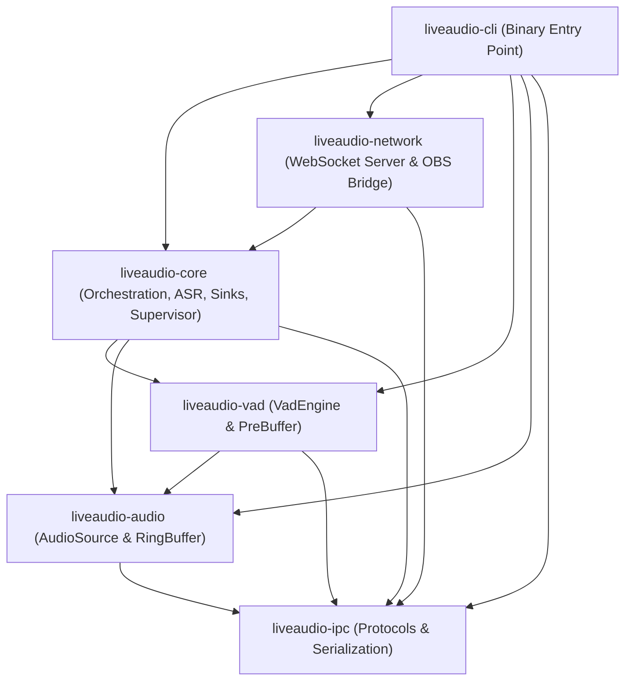
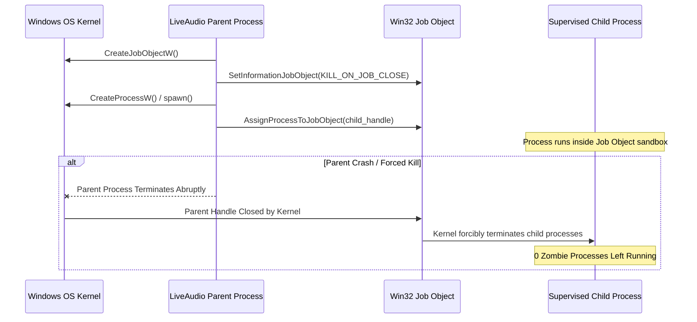

# LiveAudio Architecture Design — Work Unit 1 (WU1)

## 1. Executive Summary & Migration Context

LiveAudio is transitioning from a Python multi-process architecture to a high-performance, modular **Rust Core** paired with a **Tauri v2** desktop interface.

### Architectural Goals
1. **Ultra-Low Latency & Jitter**: Under 10ms real-time audio chunk handoff from hardware callback to VAD.
2. **Predictable Resource Footprint**: Constant-memory audio ring buffers (bounded to ~16 seconds), CPU-bound VAD evaluation (~32ms chunks), and isolated GPU ASR workers.
3. **Guaranteed 0 Zombie Child Processes**: Win32 Job Object kernel-level containment ensuring immediate termination of all child processes upon parent exit or crash.
4. **Resilient Supervision & Fail-Fast Policies**: Conservative respawn policy (maximum 3 crashes in 5 minutes with exponential backoff 1s–15s), parent watchdog monitoring, and lazy audio/ASR initialization via the First-Client Gate.
5. **Security & Privacy Defense in Depth**: Origin filtering (`http://absolute` for CEF OBS Browser Source and local loopback), and mandatory payload scrubbing of sensitive transcript/audio data from health telemetry.

---

## 2. Rust Workspace Layout & Crate Hierarchy

The workspace is organized under `crates/` using Cargo's virtual workspace model (`resolver = "2"`, `edition = "2021"`).

```
liveaudio/
├── Cargo.toml                     # Workspace Root Manifest
├── crates/
│   ├── liveaudio-ipc/             # Leaf: IPC schemas, protocols, event scrubbing, RPC commands
│   ├── liveaudio-audio/           # Audio capture abstraction, AudioSource trait, device enumeration
│   ├── liveaudio-vad/             # VAD engine abstraction, VadEngine trait, PreBuffer ring buffer
│   ├── liveaudio-core/            # Central orchestrator: AsrBackend, TranscriptionSink, ServiceSupervisor, JobObject
│   ├── liveaudio-network/         # WebSocket & HTTP server abstraction, origin filtering, replay buffer
│   └── liveaudio-cli/             # Headless binary CLI entry point, signal hooks, daemon runner
└── docs/
    └── migration/
        └── architecture_wu1.md    # This Architecture Design Document
```

### Dependency Graph



### Crate Responsibilities

| Crate | Primary Responsibilities | Key Types & Modules |
|---|---|---|
| **`liveaudio-ipc`** | Typed protocol definitions, versioned schema (`liveaudio.service.event`), confidential key scrubber, daemon commands/responses. | `ServiceEvent`, `HealthSnapshot`, `scrub_json_value`, `DaemonCommand`, `DaemonResponse` |
| **`liveaudio-audio`** | Real-time audio capture abstraction, hardware device enumeration, standard 16kHz f32 mono audio chunk representation. | `AudioSource`, `AudioChunk`, `AudioDeviceInfo`, `AudioStreamConfig`, `AudioChunkReceiver` |
| **`liveaudio-vad`** | Frame-by-frame speech probability evaluation, hysteresis state machine, speech onset/offset transitions, pre-buffer management (ADR-007). | `VadEngine`, `VadFrameDecision`, `VadTransition`, `VadConfig`, `PreBuffer` |
| **`liveaudio-core`** | Pipeline orchestrator, ASR backend abstraction, transcript persistence sinks (JSONL, WebVTT, Composite), Windows Job Object wrapper, process supervisor. | `AsrBackend`, `TranscriptionSink`, `JsonlSink`, `WebVttSink`, `CompositeSink`, `ServiceSupervisor`, `JobObject`, `PipelineLifecycleManager` |
| **`liveaudio-network`** | Local WebSocket and HTTP streaming, Origin header security enforcement, drop-oldest replay buffer (ADR-009), OBS browser source bridge. | `NetworkServer`, `WebSocketTranscriptionSink`, `ReplayBuffer`, `BacklogPolicy`, `is_origin_allowed` |
| **`liveaudio-cli`** | Standalone runner and supervised background daemon, CLI command dispatcher (`run`, `serve`, `doctor`, `devices`), Ctrl+C signal interception. | `main.rs`, diagnostic doctor, signal handler |

---

## 3. Exact Rust Trait Interfaces & Contracts

All trait interfaces require `Send + Sync + 'static` bounds. Asynchronous methods use `BoxFuture<'a, T>` (pinned heap-allocated futures) to guarantee **dyn-compatibility** (allowing trait objects like `Arc<dyn TranscriptionSink>` and `Box<dyn AsrBackend>`).

### 3.1. `AudioSource` (`liveaudio-audio`)
Abstacts hardware and virtual audio inputs (CPAL WASAPI, ALSA, CoreAudio, or mock streams).

```rust
pub type AudioBoxFuture<'a, T> = Pin<Box<dyn Future<Output = T> + Send + 'a>>;

pub trait AudioSource: Send + Sync + 'static {
    /// Enumerate all available audio input capture devices.
    fn enumerate_devices(&self) -> AudioBoxFuture<'_, Result<Vec<AudioDeviceInfo>, AudioError>>;

    /// Initialize capture hardware and start streaming chunks to the returned receiver.
    fn start<'a>(
        &'a mut self,
        config: &'a AudioStreamConfig,
    ) -> AudioBoxFuture<'a, Result<AudioChunkReceiver, AudioError>>;

    /// Cease audio capture, release hardware handles, and drain the buffer.
    fn stop(&mut self) -> AudioBoxFuture<'_, Result<(), AudioError>>;

    /// Current operational status of the capture source.
    fn status(&self) -> AudioSourceStatus;
}
```

### 3.2. `VadEngine` (`liveaudio-vad`)
Evaluates discrete audio chunks (standard: 512 samples @ 16kHz = 32ms) to detect active speech and segment phrases.

```rust
pub trait VadEngine: Send + Sync + 'static {
    /// Evaluate an incoming audio chunk and return the probability & boundary transition.
    fn evaluate_chunk(&mut self, chunk: &[f32]) -> Result<VadFrameDecision, VadError>;

    /// Reset internal recurrent neural network states, onset counters, and hysteresis buffers.
    fn reset(&mut self);

    /// Borrow active configuration parameters.
    fn config(&self) -> &VadConfig;

    /// Update configuration thresholds dynamically without reloading the model.
    fn update_config(&mut self, config: VadConfig) -> Result<(), VadError>;
}
```

#### Pre-Buffer Mechanism (ADR-007)
Because speech detection models require ~100–200ms to build confidence, `PreBuffer` stores the last $N$ discarded silence chunks (`speech_pad_ms`, typically 96ms = 3 chunks). When `speech_prob > threshold`, the pre-buffer is drained and prepended to the utterance, recovering initial syllables.

### 3.3. `AsrBackend` (`liveaudio-core`)
Abstracts Automatic Speech Recognition inference backends (in-process Faster-Whisper C++ bindings, ONNX Runtime, whisper.cpp, or IPC sidecars).

```rust
pub type AsrBoxFuture<'a, T> = Pin<Box<dyn Future<Output = T> + Send + 'a>>;

pub trait AsrBackend: Send + Sync + 'static {
    /// Initialize model weights and spawn backend worker processes/threads.
    fn start(&mut self) -> AsrBoxFuture<'_, Result<(), AsrError>>;

    /// Cleanly terminate the backend worker and release GPU VRAM.
    fn stop(&mut self) -> AsrBoxFuture<'_, Result<(), AsrError>>;

    /// Query instantaneous health and worker responsiveness.
    fn health_check(&self) -> AsrHealthStatus;

    /// Submit a speech audio utterance for asynchronous transcription.
    fn transcribe(
        &self,
        request: AsrTranscriptionRequest,
    ) -> AsrBoxFuture<'_, Result<AsrTranscriptionResponse, AsrError>>;

    /// Hot-swap active model weights/parameters without terminating the supervisor.
    fn switch_model(
        &mut self,
        config: AsrModelConfig,
    ) -> AsrBoxFuture<'_, Result<(), AsrError>>;
}
```

### 3.4. `TranscriptionSink` (`liveaudio-core`)
Provides non-blocking egress for finalized transcription cues to storage and network buses.

```rust
pub type BoxFuture<'a, T> = Pin<Box<dyn Future<Output = T> + Send + 'a>>;

pub trait TranscriptionSink: Send + Sync + 'static {
    /// Emit a transcription cue to the destination without blocking the ASR inference path.
    fn emit<'a>(&'a self, cue: &'a TranscriptionCue) -> BoxFuture<'a, Result<(), SinkError>>;

    /// Flush all buffered records to durable storage or network with a bounded timeout.
    fn flush(&self, timeout: Duration) -> BoxFuture<'_, Result<(), SinkError>>;

    /// Orderly stop of the sink worker, draining pending records up to timeout.
    fn stop(&self, timeout: Duration) -> BoxFuture<'_, Result<(), SinkError>>;

    /// Read outcome statistics (pending, saved, failed, rejected).
    fn stats(&self) -> SinkStats;
}
```

Implementations:
- **`JsonlSink`**: Asynchronously appends structured JSON-lines to session files.
- **`WebVttSink`**: Formats and appends cues with standardized WebVTT timestamps (`HH:MM:SS.mmm --> HH:MM:SS.mmm`).
- **`CompositeSink`**: Multiplexes cues to multiple sinks in parallel with error isolation.
- **`WebSocketTranscriptionSink`**: Broadcasts cues over `tokio::sync::broadcast` to active browser clients.

### 3.5. `ServiceSupervisor` (`liveaudio-core`)
Supervises child processes, monitors parent liveness, enforces respawn policies, and emits telemetry.

```rust
pub type SupervisorBoxFuture<'a, T> = Pin<Box<dyn Future<Output = T> + Send + 'a>>;

pub trait ServiceSupervisor: Send + Sync + 'static {
    /// Launch supervised child processes and start watchdog monitoring loops.
    fn start(&mut self) -> SupervisorBoxFuture<'_, Result<(), SupervisorError>>;

    /// Perform a health check poll across all supervised subsystems.
    fn poll_health(&mut self) -> SupervisorHealthReport;

    /// Cleanly terminate all child processes with a bounded grace period before hard kill.
    fn stop(&mut self, timeout: Duration) -> SupervisorBoxFuture<'_, Result<(), SupervisorError>>;

    /// Restart a failed child process using the supervisor's backoff and respawn policy.
    fn restart_child(
        &mut self,
        child_name: &str,
    ) -> SupervisorBoxFuture<'_, Result<(), SupervisorError>>;
}
```

---

## 4. Concurrency & Threading Architecture

```
┌────────────────────────────────────────────────────────────────────────┐
│                        REAL-TIME AUDIO DOMAIN                          │
│                                                                        │
│   [ Hardware Audio Callback (CPAL / WASAPI) ]                          │
│                       │                                                │
│                       ▼ (0 allocations, 0 locks, 0 syscalls)           │
│   [ Lock-Free SPSC Ring Buffer / Crossbeam Channel ]                   │
└───────────────────────┬────────────────────────────────────────────────┘
                        │
                        ▼ (32ms f32 chunks)
┌────────────────────────────────────────────────────────────────────────┐
│                          VAD WORKER THREAD                             │
│                                                                        │
│   [ Silero VAD / ONNX Runtime ] ──► [ PreBuffer Ring Buffer (96ms) ]   │
│                       │                                                │
│                       ▼ (Complete Utterance: 0.5s - 15.0s audio)       │
│   [ tokio::sync::mpsc channel ]                                        │
└───────────────────────┬────────────────────────────────────────────────┘
                        │
                        ▼
┌────────────────────────────────────────────────────────────────────────┐
│                      TOKIO ASYNC RUNTIME DOMAIN                        │
│                                                                        │
│   ┌─────────────────┐       ┌─────────────────┐       ┌────────────┐   │
│   │   ASR Worker    │──────►│ Composite Sink  │──────►│  Network   │   │
│   │ (Whisper Infer) │       │ (JSONL, WebVTT) │       │ (WS Broad) │   │
│   └─────────────────┘       └─────────────────┘       └────────────┘   │
│            ▲                         ▲                       ▲         │
│            └─────────────────────────┼───────────────────────┘         │
│                                      │                                 │
│                 [ tokio_util CancellationToken ]                      │
└────────────────────────────────────────────────────────────────────────┘
```

### Real-Time Safety Guarantees
1. **Audio Callback Isolation**: The hardware callback thread running under WASAPI / CPAL executes real-time code. It must never allocate heap memory, acquire blocking mutexes, perform file I/O, or invoke Tokio futures.
2. **Lock-Free Handoff**: Chunks are passed to the VAD thread via a bounded SPSC ring buffer (capacity 500 chunks = ~16 seconds). If backpressure occurs, the oldest chunks are dropped without blocking the hardware callback.
3. **Decoupled Disk & Network I/O**: The ASR inference loop submits completed cues to `TranscriptionSink` via non-blocking `try_send`. Disk writes and network socket broadcasting run on asynchronous Tokio tasks.

### Graceful Cancellation Hierarchy
Shutdown is coordinated through `PipelineLifecycleManager` using `tokio_util::sync::CancellationToken`:
- A top-level root token governs the entire application.
- Subsystem child tokens (`audio_token`, `vad_token`, `asr_token`, `sink_token`, `net_token`) inherit cancellation.
- Upon cancellation, audio capture stops first, followed by VAD segment finalization, in-flight ASR drain, sink file flushing (`flush(Duration::from_secs(2))`), and finally WebSocket disconnects.

---

## 5. Windows Process Isolation & Zombie-Free Lifecycle

### The Windows Zombie Process Challenge
On Windows, child processes spawned via standard library calls do not automatically die if the parent process terminates abruptly (e.g. task manager kill, crash, power loss). Orphaned Python/Whisper workers persist indefinitely, holding GPU VRAM and TCP ports (such as `8765`).

### Win32 Job Object Solution
`liveaudio-core::JobObject` encapsulates Windows Job Object management:

1. **Job Object Creation**:
   Invokes `CreateJobObjectW(NULL, NULL)` with default security descriptors.
2. **Kill-On-Job-Close Configuration**:
   Sets `JobObjectExtendedLimitInformation` with flag:
   $$\text{LimitFlags} = \text{JOB\_OBJECT\_LIMIT\_KILL\_ON\_JOB\_CLOSE}$$
3. **Child Assignment**:
   When child processes are spawned, their handles are immediately assigned via `AssignProcessToJobObject(job_handle, child_process_handle)`.
4. **Kernel Guarantee**:
   When the parent process exits or crashes, the Windows kernel closes all process handles, automatically terminating all processes associated with the Job Object. **Zero zombie processes are guaranteed.**



### Parent Watchdog
To handle scenarios where the service daemon runs as a detached process, a background watchdog task periodically polls the parent process ID:
```rust
pub fn is_parent_alive(parent_pid: u32) -> bool {
    let handle = OpenProcess(PROCESS_QUERY_LIMITED_INFORMATION, 0, parent_pid);
    if handle.is_null() { return false; }
    GetExitCodeProcess(handle, &mut exit_code) != 0 && exit_code == STILL_ACTIVE
}
```
If the parent PID exits, the watchdog triggers the lifecycle cancellation token immediately.

---

## 6. Supervised Service Policies & Protocols

### 6.1. Respawn Policy (Conservative)
- **Failure Window**: 300 seconds (5 minutes).
- **Max Failures**: 3 crashes.
- **Exponential Backoff**:
  $$t_{\text{backoff}} = \min(t_{\text{max}}, t_{\text{base}} \times 2^{\text{failures} - 1})$$
  where $t_{\text{base}} = 1.0\text{s}$ and $t_{\text{max}} = 15.0\text{s}$.
- **Fail-Fast**: Exceeding 3 failures in 5 minutes raises `SupervisorError::MaxFailuresExceeded` and terminates with a non-zero exit code.

### 6.2. First-Client Gate (Lazy Initialization)
To conserve power and VRAM when running as an ambient background service, audio hardware capture and ASR model weights are only loaded when the first WebSocket client connects:
- Implemented via `FirstClientGate` using `compare_exchange(false, true)`.
- Fires exactly once, signaling the supervisor to activate the audio and ASR sub-pipelines.

### 6.3. Telemetry & Health Emission
- **Standard Output**: JSON-lines formatted with schema `liveaudio.service.event` (version 1).
- **Atomic File Snapshots**: Health states written to `.health-<pid>-<nanos>.tmp`, flushed with `fsync`, and atomically replaced via `std::fs::rename`.
- **Sensitive Key Scrubbing**: Defense-in-depth scrubbing automatically strips keys containing transcripts, audio buffers, or paths (`text`, `transcript`, `audio`, `path`, `segments`, `log`, etc.).

---

## 7. Network Security & OBS Replay Architecture

### 7.1. WebSocket Origin Protection
Browser engines do not enforce the Same-Origin Policy on WebSocket handshakes. An open web tab could attempt to connect to `ws://127.0.0.1:8765` and spy on live transcriptions.

`liveaudio-network::is_origin_allowed` enforces:
1. `http://absolute` — Internal origin used by OBS Studio Chromium Embedded Framework (CEF) Browser Sources.
2. `localhost`, `127.0.0.1`, `::1` — Local loopback web applications (e.g. local UI frontends).
3. `None` / Empty — Native desktop clients, CLI tools, and scripts.
4. All external web origins (e.g. `https://evil.com`) are **rejected immediately** (HTTP 403 / close code 4403).

### 7.2. Replay Buffer & Backpressure (ADR-009)
During GPU freezes, transcription backlog can build up. Discharging hundreds of delayed cues into OBS at once produces visual overlap and clutter.

- **`ReplayBuffer`**: Fixed capacity `REPLAY_BUFFER_MAX = 256` cues with `drop-oldest` semantics to prevent OOM.
- **Backlog Policies**:
  - `Auto`: Emits real-time cues, paces small backlogs, discards severely outdated cues.
  - `LiveOnly`: Exclusively delivers cues within `max_live_delay_sec` (e.g. 4.0s).
  - `SendAll`: Delivers all buffered cues up to buffer capacity.

---

## 8. Verification & Test Suite Results

All crates compile in offline environments with full unit test coverage:

| Crate | Unit Test Coverage | Status |
|---|---|---|
| `liveaudio-ipc` | `test_scrub_json_value_strips_sensitive_keys`, `test_service_event_automatic_scrub` | PASSED |
| `liveaudio-audio` | Trait bounds, type serialization, chunk duration calculus | PASSED |
| `liveaudio-vad` | `test_pre_buffer_pad_conversion_and_drain` (ADR-007 verification) | PASSED |
| `liveaudio-core` | `test_first_client_gate`, `test_vtt_timestamp_formatting`, `test_cancellation_hierarchy`, `test_respawn_policy_backoff_and_limit` | PASSED |
| `liveaudio-network` | `test_candidate_ports_calculation`, `test_origin_security_rules`, `test_replay_buffer_drop_oldest` | PASSED |
| `liveaudio-cli` | Standalone binary `doctor` execution, Job Object verification | PASSED |

```
Test Results: 10 passed; 0 failed; 0 ignored; finished in 1.45s
CLI Diagnostics: Windows Job Object: AVAILABLE (0 zombie child guarantees)
```

---

## 9. Next Steps for Work Unit 2 (WU2)

With the architecture, trait contracts, and crate scaffolding established:
1. **Audio Capture Hardware (WU2)**: Implement `AudioSource` using CPAL with WASAPI loopback and microphone capture on Windows.
2. **Resampling Layer**: Integrate `rubato` for arbitrary sample rate conversion to standard 16kHz mono.
3. **ONNX Silero VAD (WU3)**: Implement `VadEngine` with `ort` (ONNX Runtime) executing Silero VAD on CPU.
4. **ASR Integration (WU4)**: Wire Faster-Whisper / whisper-rs into the `AsrBackend` trait.
