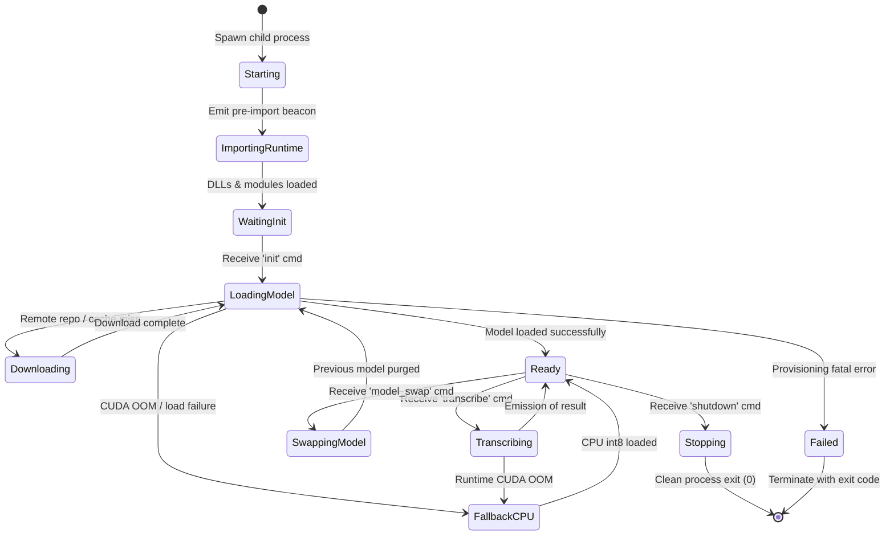
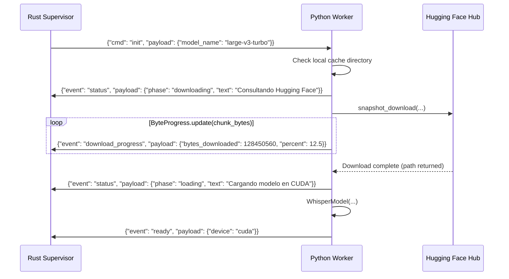
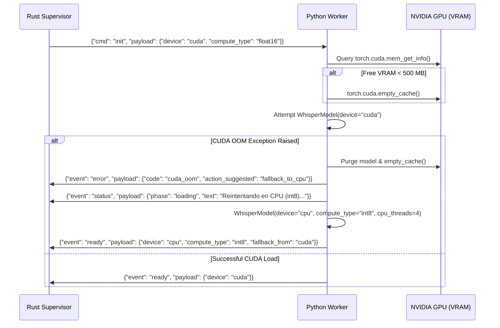
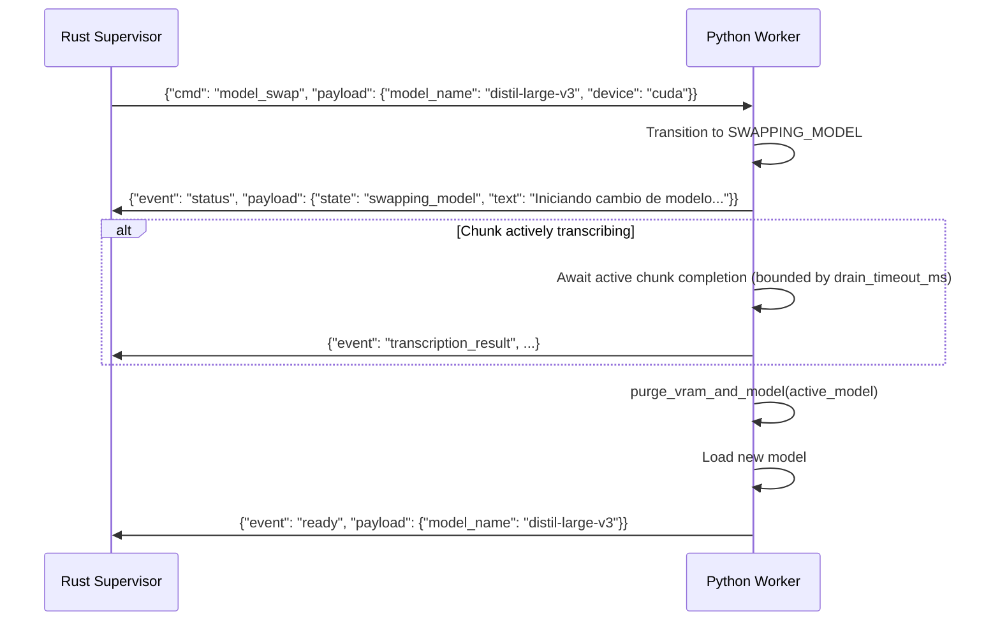
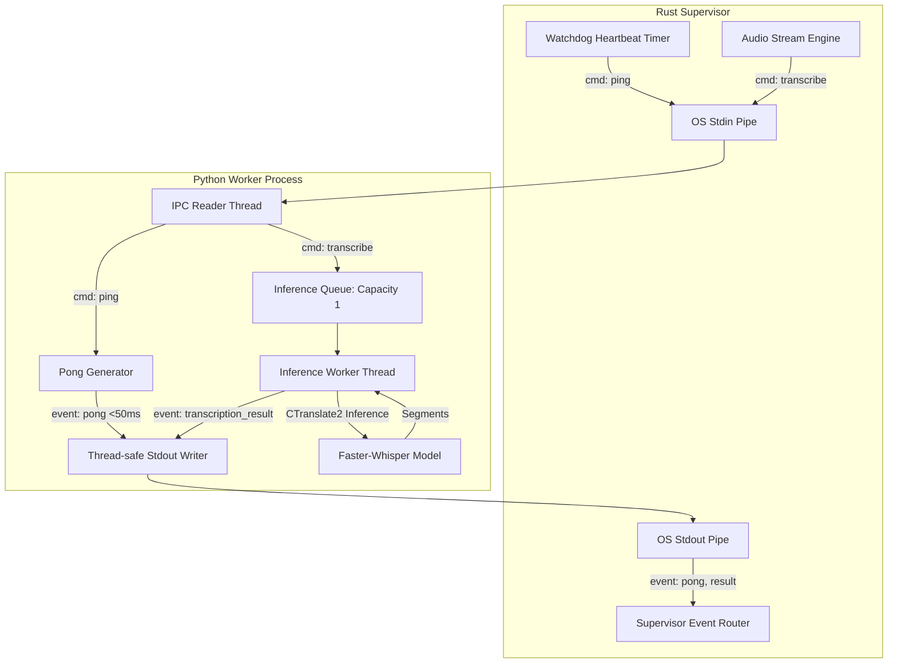

# LiveAudio Migration: Faster-Whisper Python Interop IPC Protocol (WU1)

- **Document Version**: 1.0.0
- **Protocol Version**: 1
- **Status**: Approved Architecture Specification (Work Unit 1)
- **Target Subsystems**: Rust Core Supervisor (`liveaudio-core`), Python ASR Worker (`liveaudio-asr-worker`), Tauri 2.0 Backend

---

## 1. Executive Summary & Architecture Context

LiveAudio is migrating its orchestration, audio capture, Voice Activity Detection (VAD), session storage, and desktop presentation layer from Python/PyQt to a modern **Rust Core + Tauri 2.0** architecture.

Speech-to-Text inference utilizes **Faster-Whisper** (CTranslate2 + PyTorch execution engines). In this architecture, Faster-Whisper remains in a dedicated, isolated **Python worker process** for the following architectural reasons:

1. **Failure Domain Isolation**: Native CUDA memory allocations, cuBLAS/cuDNN exceptions, CTranslate2 C++ panics, or PyTorch DLL initializations are completely isolated from the Rust desktop application. A GPU driver crash or out-of-memory error cannot crash the UI or corrupt audio sessions.
2. **Binary Footprint & Portability**: Embedding libtorch and CTranslate2 directly into the Rust binary increases build complexity exponentially on Windows (MSVC linkage, CUDA toolkit versions, DLL manifests). A decoupled worker uses standard Python packaging (`uv`, portable Python) with zero Rust compile-time dependencies on PyTorch.
3. **Seamless Upgradability & Multi-Model Ecosystem**: Hugging Face model downloads, tokenizer configurations, and community quantization formats are natively supported by Faster-Whisper without maintaining Rust bindings.

This document formalizes the **Versioned IPC Protocol (v1)** connecting the Rust Core supervisor and the Python Faster-Whisper worker.

---

## 2. IPC Transport Evaluation & Decision Matrix

To select the optimal Inter-Process Communication (IPC) transport on Windows (with full cross-platform compatibility for macOS and Linux), we evaluated four candidates:

| Criterion | Stdin/Stdout JSON Lines (NDJSON) | Windows Named Pipes / Unix Sockets | Hybrid Framing (Length-Prefixed Binary + JSON) | Shared Memory (Memory-Mapped Files) |
| :--- | :--- | :--- | :--- | :--- |
| **Setup Complexity** | **Very Low** (Standard OS pipes) | Medium (Win32 Named Pipe server / Unix paths) | Low (Standard OS pipes with framing) | High (OS mutexes, ring buffers, cleanup) |
| **Crash Cleanup / Lifecycle** | **Automatic**: OS closes pipe on process exit, providing immediate EOF | **Complex**: Orphan pipes or broken socket files require cleanup | **Automatic**: OS closes pipe on exit | **Fragile**: Stale memory segments require manual GC |
| **Cross-Platform Parity** | **100% Identical** (Windows, macOS, Linux) | Requires `cfg(windows)` NamedPipe vs `cfg(unix)` UDS | **100% Identical** | OS-specific API variance |
| **Audio Transfer Overhead** | Base64 adds ~33% bytes & ~0.2ms decode | Raw binary: 0% overhead | Raw binary: 0% overhead | Raw binary: 0% overhead (Zero-copy) |
| **Stream Sync / Framing** | Single-line JSON guarantees no byte desync | Packet or byte stream | Requires framing parser & resync logic | Ring-buffer pointers |
| **Observability & Debugging** | **Trivial** (Human-readable text in CLI/logs) | Requires packet capture / custom proxy | Requires hex dump / custom decoder | Requires memory dump |
| **Deadlock Risk** | Zero (if stdout/stderr are read concurrently) | Low | Zero (if pipes drained) | High (lock contention) |

### Performance Reality of Base64 vs Raw Binary
In LiveAudio, speech utterances segmented by Silero VAD typically measure between **1.5 and 8.0 seconds**:
- **Format**: 16,000 Hz, 1 channel (mono), 32-bit floating point (`f32le`).
- **Data Rate**: 16,000 samples/sec × 4 bytes = **64 KB/sec**.
- **Typical 4-second chunk**: 256 KB binary PCM.
- **Base64 encoded chunk**: ~341 KB ASCII.
- **Python `base64.b64decode` + `np.frombuffer` benchmark**: **0.14 ms** on modern x86_64 CPUs.
- **Faster-Whisper CUDA inference time**: **120 ms to 450 ms** (Real-Time Factor 0.03 - 0.08).
- **Overhead**: Base64 decoding accounts for **< 0.12%** of the transcription pipeline latency.

### Architecture Decision: Dual-Mode Architecture

1. **Default Primary Protocol**: **JSON Lines over Stdin/Stdout (NDJSON)**.
   - Command and event exchange over standard OS pipes.
   - Audio is transmitted as Base64-encoded `f32le` PCM in the `transcribe` payload.
   - Eliminates platform-dependent socket management and provides instant EOF propagation on process death.
2. **High-Performance Streaming Extension**: **Length-Prefixed Binary Framing (LPB)**.
   - An opt-in protocol negotiated during `init` handshake (`audio_framing: "binary"`).
   - Allows streaming continuous raw PCM chunks over stdin without Base64 encoding.

Both framing formats share the **exact same versioned message payload schemas**.

---

## 3. Wire Protocol Specifications

### 3.1 Standard Mode: JSON Lines (NDJSON)

In Standard Mode, messages are transmitted as UTF-8 encoded JSON strings, each strictly followed by a single newline character (`\n`, ASCII `0x0A`):

```
+-------------------------------------------------------------+----+
|  UTF-8 JSON Message Payload (Strictly single-line, no \n)   | \n |
+-------------------------------------------------------------+----+
```

#### Transmission Rules:
1. Every message must fit on a single line terminated by `\n`.
2. Python and Rust must flush the stream immediately after writing each message (`sys.stdout.flush()` in Python; `writer.flush().await` in Rust).
3. `stderr` of the Python worker is strictly reserved for diagnostic logs, stack traces, and CTranslate2 native warnings. It is captured by the Rust supervisor and routed to the Rust tracing subsystem (`tracing::warn!`, `tracing::error!`).
4. Any non-JSON line appearing on `stdout` is treated by Rust as an unformatted worker diagnostic message and logged at `tracing::info!`.

---

### 3.2 High-Performance Mode: Length-Prefixed Binary (LPB) Framing

When `audio_framing: "binary"` is negotiated during the `init` handshake, messages use a 12-byte binary header followed by a JSON header and optional raw binary payload.

#### Byte-Level Layout:

```
 0                   1                   2                   3
 0 1 2 3 4 5 6 7 8 9 0 1 2 3 4 5 6 7 8 9 0 1 2 3 4 5 6 7 8 9 0 1
+-+-+-+-+-+-+-+-+-+-+-+-+-+-+-+-+-+-+-+-+-+-+-+-+-+-+-+-+-+-+-+-+
|       Magic: 'L' 'A' (0x4C41) | MsgType (u8)  |  Flags (u8)   |
+-+-+-+-+-+-+-+-+-+-+-+-+-+-+-+-+-+-+-+-+-+-+-+-+-+-+-+-+-+-+-+-+
|                  Header Length (u32 LE)                       |
+-+-+-+-+-+-+-+-+-+-+-+-+-+-+-+-+-+-+-+-+-+-+-+-+-+-+-+-+-+-+-+-+
|                  Payload Length (u32 LE)                      |
+-+-+-+-+-+-+-+-+-+-+-+-+-+-+-+-+-+-+-+-+-+-+-+-+-+-+-+-+-+-+-+-+
|                  JSON Metadata (UTF-8)                        |
|                  ... (Header Length bytes)                    |
+-+-+-+-+-+-+-+-+-+-+-+-+-+-+-+-+-+-+-+-+-+-+-+-+-+-+-+-+-+-+-+-+
|                  Binary Audio Data (f32le PCM)                |
|                  ... (Payload Length bytes)                   |
+-+-+-+-+-+-+-+-+-+-+-+-+-+-+-+-+-+-+-+-+-+-+-+-+-+-+-+-+-+-+-+-+
```

#### Field Specifications:
- **Magic Bytes** (`2 bytes`, `0x4C 0x41` = ASCII `"LA"`): Delimiter used to confirm framing alignment.
- **MsgType** (`1 byte`):
  - `0x01`: JSON Control Message (Commands: `init`, `ping`, `shutdown`, `update_config`, `model_swap`; Events: `ready`, `status`, `download_progress`, `pong`, `error`). Payload Length is `0`.
  - `0x02`: Transcribe Command with Binary Audio. Header contains JSON transcribe metadata; Payload contains raw `f32le` PCM.
  - `0x03`: Transcription Result with Binary Feature (optional embeddings or audio alignment).
- **Flags** (`1 byte`):
  - `0x00`: Standard uncompressed frame.
  - `0x01`: Urgent / High-priority frame.
- **Header Length** (`4 bytes`, Little-Endian `u32`): Size in bytes of the UTF-8 JSON message.
- **Payload Length** (`4 bytes`, Little-Endian `u32`): Size in bytes of the trailing binary audio buffer (`num_samples * 4`).
- **Binary Audio Data**: Contiguous, 4-byte aligned IEEE 754 single-precision floats (`f32le`). In Python, parsed directly via `np.frombuffer(raw_bytes, dtype=np.float32)`.

---

## 4. Audio Payload Specification

Regardless of whether Base64 (Standard) or LPB (Binary) framing is utilized, audio passed to the worker must adhere to the following strict audio format contract:

| Parameter | Value | Description |
| :--- | :--- | :--- |
| **Sample Rate** | `16000` | 16 kHz native sampling required by Whisper models. |
| **Channels** | `1` | Monophonic (single audio channel). |
| **Sample Format** | `IEEE 754 float32` | 32-bit floating point, Little-Endian (`f32le`). |
| **Dynamic Range** | `[-1.0, 1.0]` | Normalized peak range. Values exceeding ±1.0 are soft-clipped. |
| **Alignment** | `4-byte` | Every sample is exactly 4 bytes; total bytes = `samples * 4`. |
| **Maximum Duration** | `30.0 seconds` | Hard upper limit per chunk (Whisper context window). LiveAudio chunks are typically 2.0-8.0s. |
| **Pre-roll Padding** | Configurable | Silero VAD pre-speech lead-in chunks (default 128-256ms) prepended to prevent consonant clipping. |

---

## 5. Message Envelope & Headers Catalog

Every message exchanged across the IPC channel shares a mandatory, versioned envelope structure.

### 5.1 Common Envelope Structure

```json
{
  "version": 1,
  "seq": 1042,
  "session_id": "sess-20261008-01",
  "attempt_id": 1,
  "correlation_id": "corr-uuid-98a7",
  "timestamp_ms": 1775520001234
}
```

#### Envelope Field Definitions:
- **`version`** (`integer`, required): Protocol specification version. Always `1` for this protocol.
- **`seq`** (`integer`, unsigned 64-bit, required): Monotonically increasing sequence number per transmitter. Rust supervisor and Python worker each maintain their own independent counter starting at `1`. Allows detection of lost or out-of-order messages.
- **`session_id`** (`string`, required): Identifier for the active LiveAudio transcription session. Inherited across worker reloads and model swaps.
- **`attempt_id`** (`integer`, unsigned 32-bit, required): Worker lifecycle attempt counter. Starts at `1` on initial spawn; incremented by Rust on worker respawn.
- **`correlation_id`** (`string`, optional/required for commands): Unique identifier (e.g. UUIDv4 or monotonic prefix `req-N`) assigned to commands. Worker events that respond to a specific command (`transcription_result`, `pong`, `ready`, command-specific `error`) must echo this `correlation_id`.
- **`timestamp_ms`** (`integer`, unsigned 64-bit, required): Unix timestamp in milliseconds when the message was serialized.

---

## 6. Complete Schema Catalog: Rust -> Worker Commands

### 6.1 `cmd: "init"`
Sent by the Rust supervisor immediately after detecting worker startup to configure and load the model.

```json
{
  "version": 1,
  "seq": 1,
  "session_id": "sess-20261008-01",
  "attempt_id": 1,
  "correlation_id": "cmd-init-001",
  "timestamp_ms": 1775520000000,
  "cmd": "init",
  "payload": {
    "model_name": "large-v3-turbo",
    "device": "cuda",
    "device_index": 0,
    "compute_type": "float16",
    "cpu_threads": 4,
    "cache_dir": null,
    "local_files_only": false,
    "language": "es",
    "initial_prompt": "Transcripción en directo para streaming",
    "beam_size": 5,
    "temperature": 0.0,
    "vad_filter": false,
    "condition_on_previous_text": false,
    "audio_framing": "base64",
    "auto_cpu_fallback": true
  }
}
```

#### Fields Description:
- `model_name` (`string`): Model size alias (`"tiny"`, `"base"`, `"small"`, `"medium"`, `"large-v3"`, `"large-v3-turbo"`, `"distil-large-v3"`) or absolute path to a local directory.
- `device` (`string`): Target compute hardware: `"cuda"` or `"cpu"`.
- `device_index` (`integer`, default `0`): GPU device ordinal index.
- `compute_type` (`string`): Quantization / precision format: `"float16"`, `"int8"`, `"float32"`, `"int8_float16"`, or `"default"`.
- `cpu_threads` (`integer`, default `4`): Thread pool size when running on CPU.
- `cache_dir` (`string | null`): Custom Hugging Face / CTranslate2 model cache path.
- `local_files_only` (`boolean`, default `false`): If `true`, fails if model is not already cached locally.
- `language` (`string`, default `"es"`): Default ISO 639-1 language code.
- `initial_prompt` (`string | null`): Contextual vocabulary bias prompt.
- `beam_size` (`integer`, default `5`): Beam search width.
- `temperature` (`float`, default `0.0`): Sampling temperature.
- `vad_filter` (`boolean`, default `false`): Faster-Whisper internal Silero VAD (disabled by default because LiveAudio executes VAD in Rust).
- `condition_on_previous_text` (`boolean`, default `false`): Disables context carry-over to avoid hallucination loops.
- `audio_framing` (`string`, default `"base64"`): Transport framing mode: `"base64"` or `"binary"`.
- `auto_cpu_fallback` (`boolean`, default `true`): Automatically switch to CPU on CUDA OOM.

---

### 6.2 `cmd: "transcribe"`
Submits an utterance speech chunk for transcription.

```json
{
  "version": 1,
  "seq": 2,
  "session_id": "sess-20261008-01",
  "attempt_id": 1,
  "correlation_id": "tx-1775520005000-0",
  "timestamp_ms": 1775520005000,
  "cmd": "transcribe",
  "payload": {
    "utterance_id": "1775520005000-0",
    "sequence": 42,
    "audio_data": "AAAAgD8AAAC/AAAA...[Base64 string]...",
    "sample_rate": 16000,
    "channels": 1,
    "duration_ms": 3250,
    "language": "es",
    "context_prompt": "Prompt de contexto dinámico",
    "beam_size": 5,
    "temperature": 0.0,
    "timeout_ms": 15000
  }
}
```

#### Fields Description:
- `utterance_id` (`string`): Unique utterance identifier (`"{monotonic_timestamp_ms}-{seq}"`).
- `sequence` (`integer`): Monotonic utterance index in current session.
- `audio_data` (`string | null`): Base64-encoded `f32le` PCM bytes. Set to `null` if LPB binary framing is used.
- `sample_rate` (`integer`, default `16000`): Audio sample rate in Hz.
- `channels` (`integer`, default `1`): Number of channels.
- `duration_ms` (`integer`): Audio duration in milliseconds.
- `language` (`string | null`): Override language for this chunk; if `null`, inherits active session language.
- `context_prompt` (`string | null`): Dynamic vocabulary prompt for this chunk.
- `beam_size` (`integer`, default `5`): Beam size override.
- `timeout_ms` (`integer`, default `15000`): Watchdog timeout budget for this transcription.

---

### 6.3 `cmd: "update_config"`
Hot-updates runtime parameters without reloading the neural network weights into memory.

```json
{
  "version": 1,
  "seq": 3,
  "session_id": "sess-20261008-01",
  "attempt_id": 1,
  "correlation_id": "cmd-cfg-002",
  "timestamp_ms": 1775520010000,
  "cmd": "update_config",
  "payload": {
    "language": "en",
    "initial_prompt": "Live conference stream vocabulary",
    "beam_size": 3,
    "cpu_threads": 6
  }
}
```

---

### 6.4 `cmd: "model_swap"`
Triggers a clean, leak-free hot-swap of the active model or execution device.

```json
{
  "version": 1,
  "seq": 4,
  "session_id": "sess-20261008-01",
  "attempt_id": 1,
  "correlation_id": "cmd-swap-001",
  "timestamp_ms": 1775520015000,
  "cmd": "model_swap",
  "payload": {
    "model_name": "distil-large-v3",
    "device": "cuda",
    "compute_type": "float16",
    "cpu_threads": 4,
    "drain_active_chunk": true,
    "drain_timeout_ms": 5000
  }
}
```

---

### 6.5 `cmd: "ping"`
Liveness heartbeat probe sent periodically by the Rust watchdog supervisor.

```json
{
  "version": 1,
  "seq": 5,
  "session_id": "sess-20261008-01",
  "attempt_id": 1,
  "correlation_id": "ping-104",
  "timestamp_ms": 1775520020000,
  "cmd": "ping",
  "payload": {
    "client_monotonic_ms": 482015
  }
}
```

---

### 6.6 `cmd: "shutdown"`
Initiates an orderly worker teardown.

```json
{
  "version": 1,
  "seq": 6,
  "session_id": "sess-20261008-01",
  "attempt_id": 1,
  "correlation_id": "cmd-sd-001",
  "timestamp_ms": 1775520030000,
  "cmd": "shutdown",
  "payload": {
    "grace_timeout_ms": 3000,
    "flush_cache": true
  }
}
```

---

## 7. Complete Schema Catalog: Worker -> Rust Events

### 7.1 `event: "ready"`
Emitted when the model is loaded in memory and the worker is ready to accept transcription chunks.

```json
{
  "version": 1,
  "seq": 1,
  "session_id": "sess-20261008-01",
  "attempt_id": 1,
  "correlation_id": "cmd-init-001",
  "timestamp_ms": 1775520002150,
  "event": "ready",
  "payload": {
    "model_name": "large-v3-turbo",
    "model_path": "C:/Users/.../models/models--mobiuslabsgmbh--faster-whisper-large-v3-turbo/snapshots/...",
    "device": "cuda",
    "device_index": 0,
    "compute_type": "float16",
    "device_name": "NVIDIA GeForce RTX 4080",
    "vram_total_mb": 16376,
    "vram_free_mb": 14120,
    "ram_used_mb": 1824,
    "load_time_sec": 1.45,
    "worker_pid": 28412,
    "python_version": "3.11.9",
    "faster_whisper_version": "1.0.3",
    "ctranslate2_version": "4.4.0",
    "cuda_available": true,
    "fallback_from": null
  }
}
```

---

### 7.2 `event: "status"`
Reports operational state transitions. Emitted across startup, model loading, decoding, and stalling.

```json
{
  "version": 1,
  "seq": 2,
  "session_id": "sess-20261008-01",
  "attempt_id": 1,
  "correlation_id": null,
  "timestamp_ms": 1775520000050,
  "event": "status",
  "payload": {
    "state": "loading",
    "phase": "loading",
    "attempt": 1,
    "text": "ASR: cargando modelo en CUDA",
    "asr_state_legacy": "loading",
    "is_download": false,
    "code": null
  }
}
```

#### Honest State Catalog (`state` / `phase`):
- `"starting"`: Child process launched; emitting pre-import heartbeat.
- `"importing_runtime"`: Python loading PyTorch and CTranslate2 native DLLs.
- `"waiting_init"`: Imports complete; awaiting `init` command from Rust.
- `"downloading"`: Model snapshot downloading from Hugging Face.
- `"loading"`: Reading model weights into GPU VRAM or system RAM.
- `"ready"`: Worker ready for inference.
- `"transcribing"`: In the process of transcribing an audio chunk.
- `"swapping_model"`: Performing zero-leak hot swap.
- `"stalled"`: Model download or load has produced zero progress for >120s.
- `"failed"`: Unrecoverable failure.

---

### 7.3 `event: "download_progress"`
Emitted during model downloading, with byte counters and completion percentages.

```json
{
  "version": 1,
  "seq": 3,
  "session_id": "sess-20261008-01",
  "attempt_id": 1,
  "correlation_id": null,
  "timestamp_ms": 1775520001200,
  "event": "download_progress",
  "payload": {
    "phase": "downloading",
    "percent": 42.5,
    "bytes_downloaded": 671088640,
    "bytes_total": 1572864000,
    "speed_bps": 33554432,
    "eta_sec": 26.8,
    "file_name": "model.bin",
    "text": "ASR: descargando (640.0 MiB disponibles)",
    "attempt": 1,
    "code": null
  }
}
```

---

### 7.4 `event: "transcription_result"`
Emitted upon successful chunk inference.

```json
{
  "version": 1,
  "seq": 4,
  "session_id": "sess-20261008-01",
  "attempt_id": 1,
  "correlation_id": "tx-1775520005000-0",
  "timestamp_ms": 1775520005320,
  "event": "transcription_result",
  "payload": {
    "utterance_id": "1775520005000-0",
    "sequence": 42,
    "text": "Bienvenidos a la transmisión en directo con subtítulos instantáneos.",
    "language": "es",
    "language_probability": 0.992,
    "duration_sec": 3.25,
    "inference_sec": 0.318,
    "real_time_factor": 0.098,
    "segments": [
      {
        "id": 0,
        "start": 0.0,
        "end": 3.22,
        "text": "Bienvenidos a la transmisión en directo con subtítulos instantáneos.",
        "avg_logprob": -0.142,
        "no_speech_prob": 0.001,
        "compression_ratio": 1.28,
        "words": [
          {"word": "Bienvenidos", "start": 0.0, "end": 0.58, "probability": 0.99},
          {"word": "a", "start": 0.58, "end": 0.68, "probability": 0.99},
          {"word": "la", "start": 0.68, "end": 0.78, "probability": 0.99},
          {"word": "transmisión", "start": 0.78, "end": 1.42, "probability": 0.98}
        ]
      }
    ],
    "vram_free_mb": 14102,
    "ram_used_mb": 1840
  }
}
```

---

### 7.5 `event: "error"`
Structured error reporting matching the LiveAudio provisioning and runtime catalog.

```json
{
  "version": 1,
  "seq": 5,
  "session_id": "sess-20261008-01",
  "attempt_id": 1,
  "correlation_id": "tx-1775520005000-0",
  "timestamp_ms": 1775520005350,
  "event": "error",
  "payload": {
    "code": "cuda_oom",
    "message": "CUDA out of memory while allocating tensor for decoding",
    "exception_type": "OutOfMemoryError",
    "utterance_id": "1775520005000-0",
    "recoverable": true,
    "fallback_occurred": true,
    "action_suggested": "fallback_to_cpu",
    "details": {
      "vram_allocated_mb": 7950,
      "vram_reserved_mb": 8120,
      "vram_total_mb": 8192
    }
  }
}
```

#### Error Codes Catalog (`code`):
- `"model-not-found"`: Specified local directory or repository does not exist.
- `"cuda_oom"`: CUDA Out-Of-Memory encountered during load or decode.
- `"provision-disk-full"`: Insufficient storage while downloading model snapshot.
- `"provision-network"`: Network connection failed during model download.
- `"provision-tls"`: TLS / Certificate verification failure.
- `"provision-auth"`: Hugging Face authentication required (401/403).
- `"provision-cache-corrupt"`: Checksum verification failure in cached snapshot.
- `"provision-timeout-stalled"`: Zero download/load progress exceeding watchdog stall threshold.
- `"decode_timeout"`: Inference exceeded specified deadline budget.
- `"invalid_audio"`: Audio payload size mismatch or unparseable buffer.
- `"worker_internal"`: Uncaught Python exception.

---

### 7.6 `event: "pong"`
Response to watchdog `ping`.

```json
{
  "version": 1,
  "seq": 6,
  "session_id": "sess-20261008-01",
  "attempt_id": 1,
  "correlation_id": "ping-104",
  "timestamp_ms": 1775520020002,
  "event": "pong",
  "payload": {
    "client_monotonic_ms": 482015,
    "worker_monotonic_ms": 482017,
    "state": "idle",
    "active_utterance_id": null,
    "queue_depth": 0,
    "vram_free_mb": 14102,
    "ram_used_mb": 1840
  }
}
```

---

## 8. Worker Lifecycle, State Machines & Resilience

### 8.1 Worker Lifecycle State Machine



---

### 8.2 Cold Start Import Latency Mitigation

#### Problem
On Windows, importing `torch`, `ctranslate2`, and `faster_whisper` requires resolving several gigabytes of native DLLs (`torch_cuda.dll`, `cudnn64_8.dll`, `cublas64_11.dll`). On cold disk caches or lower-spec machines, `import torch` can take **3 to 8 seconds**. If the Rust supervisor enforces a strict initial probe timeout (e.g., 2 seconds), it will erroneously kill the child process thinking it is hung.

#### Solution: Pre-Import Status Beacon
The Python worker entrypoint executes zero heavy imports on initial boot. Instead, it imports only Python standard library modules (`sys`, `os`, `json`, `time`), configures unbuffered standard I/O, and immediately emits a pre-import status beacon:

```python
# Entrypoint: liveaudio/service/asr_worker.py
import sys, os, json, time

# Guarantee unbuffered line-based stdout
sys.stdout.reconfigure(line_buffering=True, encoding="utf-8")

# Emit immediate pre-import beacon (< 50ms)
beacon = {
    "version": 1,
    "seq": 1,
    "session_id": "bootstrap",
    "attempt_id": 1,
    "correlation_id": None,
    "timestamp_ms": int(time.time() * 1000),
    "event": "status",
    "payload": {
        "state": "starting",
        "phase": "importing_runtime",
        "attempt": 1,
        "text": "Worker process spawned, importing dependencies...",
        "asr_state_legacy": "loading",
        "is_download": False,
        "code": None
    }
}
sys.stdout.write(json.dumps(beacon) + "\n")
sys.stdout.flush()

# Register PyTorch DLL directories for Windows
from liveaudio.utils.torch_dll import ensure_torch_dlls
ensure_torch_dlls()

# Now proceed with heavy imports
import torch
from faster_whisper import WhisperModel
```

#### Rust Supervisor Reaction
Upon receiving the pre-import beacon within 500ms of spawn, the Rust supervisor marks the worker state as `ImportingRuntime` and extends the initial watchdog timeout to **60.0 seconds**, completely eliminating false-positive watchdog kills during cold boot.

---

### 8.3 Model Download Progress Forwarding (tqdm Hook)

Faster-Whisper delegates model snapshot downloads to `huggingface_hub.snapshot_download`.
The worker hooks into the download pipeline using a custom `tqdm` progress interceptor (`ByteProgress`), forwarding real-time byte counters to the Rust supervisor:



#### Throttling & Monotonic Guarantee
- Progress events are rate-limited to a maximum of **1 event every 250 ms** to avoid flooding the IPC channel.
- A monotonic clamp ensures that `percent` never decreases within the same download attempt.
- If zero download progress is detected for **150 seconds** (configurable `STALL_TIMEOUT_SEC = 150.0`), the worker emits `event: "error", code: "provision-timeout-stalled"` and offers a clean retry.

---

### 8.4 CUDA Out-Of-Memory (OOM) Recovery & CPU Fallback

CUDA out-of-memory errors can occur during:
1. **Initial Model Load**: Model weights do not fit in available VRAM.
2. **Dynamic Transcription**: A long audio chunk or high beam search creates an intermediate tensor that exceeds remaining VRAM.



#### Zero-Leak VRAM Cleanup Procedure
To guarantee that failed allocations or replaced models release 100% of GPU resources, the worker follows this strict teardown sequence:

```python
def purge_vram_and_model(model_ref):
    del model_ref
    import gc
    gc.collect()
    if torch.cuda.is_available():
        torch.cuda.empty_cache()
        torch.cuda.ipc_collect()
```

---

### 8.5 Hot-Swap Model Reload State Machine

LiveAudio allows the user to switch models on the fly (e.g. from `large-v3-turbo` to `distil-large-v3` or change devices) from the Settings UI without restarting the application or losing audio pipeline state.



---

### 8.6 Concurrency Architecture & Ping/Pong Heartbeat Watchdog

#### The Problem with Single-Threaded Workers
If a Python worker process is single-threaded, running `model.transcribe(chunk)` executes synchronous C++ CTranslate2 loops. During this time, the Python Global Interpreter Lock (GIL) and event loop are blocked. A `ping` sent by the Rust watchdog would sit unread in the stdin buffer for several seconds, causing the supervisor to misdiagnose the worker as dead and issue a SIGKILL.

#### The Dual-Thread Worker Architecture
To guarantee responsive watchdog replies (< 50ms) even while transcribing heavy audio chunks:
1. **IPC Reader Thread (`MainThread`)**:
   - Continuously reads lines from `sys.stdin`.
   - Handles `ping` commands immediately and responds with `pong` (reporting `state: "transcribing"`, `active_utterance_id`, and memory metrics).
   - Handles `shutdown` commands immediately.
   - Forwards `transcribe` commands to an internal task queue (`queue.Queue`).
2. **Inference Worker Thread (`WorkerThread`)**:
   - Pulls audio tasks from the task queue.
   - Executes `model.transcribe(...)`.
   - Sends `transcription_result` or `error` events to `sys.stdout` via a thread-safe writer lock.



---

## 9. Rust Core Data Structures (`serde`)

Below is the definitive Rust structure definition for the IPC protocol, designed for `liveaudio-core` using `serde`:

```rust
// File: crates/liveaudio-core/src/asr/protocol.rs
use serde::{Deserialize, Serialize};

pub const PROTOCOL_VERSION: u32 = 1;

/// Common envelope shared across all IPC messages.
#[derive(Debug, Clone, Serialize, Deserialize)]
pub struct MessageEnvelope<T> {
    pub version: u32,
    pub seq: u64,
    pub session_id: String,
    pub attempt_id: u32,
    #[serde(skip_serializing_if = "Option::is_none")]
    pub correlation_id: Option<String>,
    pub timestamp_ms: u64,
    #[serde(flatten)]
    pub body: T,
}

/// Commands sent from Rust Supervisor to Python Worker.
#[derive(Debug, Clone, Serialize, Deserialize)]
#[serde(tag = "cmd", content = "payload")]
pub enum RustToWorkerCommand {
    #[serde(rename = "init")]
    Init(InitPayload),

    #[serde(rename = "transcribe")]
    Transcribe(TranscribePayload),

    #[serde(rename = "update_config")]
    UpdateConfig(UpdateConfigPayload),

    #[serde(rename = "model_swap")]
    ModelSwap(ModelSwapPayload),

    #[serde(rename = "ping")]
    Ping(PingPayload),

    #[serde(rename = "shutdown")]
    Shutdown(ShutdownPayload),
}

#[derive(Debug, Clone, Serialize, Deserialize)]
pub struct InitPayload {
    pub model_name: String,
    pub device: String,
    #[serde(default)]
    pub device_index: u32,
    pub compute_type: String,
    #[serde(default = "default_cpu_threads")]
    pub cpu_threads: u32,
    #[serde(default)]
    pub cache_dir: Option<String>,
    #[serde(default)]
    pub local_files_only: bool,
    #[serde(default = "default_language")]
    pub language: String,
    pub initial_prompt: Option<String>,
    #[serde(default = "default_beam_size")]
    pub beam_size: u32,
    #[serde(default)]
    pub temperature: f32,
    #[serde(default)]
    pub vad_filter: bool,
    #[serde(default)]
    pub condition_on_previous_text: bool,
    #[serde(default = "default_framing")]
    pub audio_framing: String,
    #[serde(default = "default_true")]
    pub auto_cpu_fallback: bool,
}

#[derive(Debug, Clone, Serialize, Deserialize)]
pub struct TranscribePayload {
    pub utterance_id: String,
    pub sequence: u64,
    /// Base64-encoded float32 LE PCM data (null in raw binary mode)
    pub audio_data: Option<String>,
    #[serde(default = "default_sample_rate")]
    pub sample_rate: u32,
    #[serde(default = "default_channels")]
    pub channels: u32,
    pub duration_ms: u32,
    pub language: Option<String>,
    pub context_prompt: Option<String>,
    #[serde(default = "default_beam_size")]
    pub beam_size: u32,
    #[serde(default)]
    pub temperature: f32,
    #[serde(default = "default_timeout_ms")]
    pub timeout_ms: u32,
}

#[derive(Debug, Clone, Serialize, Deserialize)]
pub struct UpdateConfigPayload {
    pub language: Option<String>,
    pub initial_prompt: Option<String>,
    pub beam_size: Option<u32>,
    pub cpu_threads: Option<u32>,
}

#[derive(Debug, Clone, Serialize, Deserialize)]
pub struct ModelSwapPayload {
    pub model_name: String,
    pub device: String,
    pub compute_type: String,
    pub cpu_threads: Option<u32>,
    #[serde(default = "default_true")]
    pub drain_active_chunk: bool,
    #[serde(default = "default_drain_timeout")]
    pub drain_timeout_ms: u32,
}

#[derive(Debug, Clone, Serialize, Deserialize)]
pub struct PingPayload {
    pub client_monotonic_ms: u64,
}

#[derive(Debug, Clone, Serialize, Deserialize)]
pub struct ShutdownPayload {
    #[serde(default = "default_shutdown_timeout")]
    pub grace_timeout_ms: u32,
    #[serde(default = "default_true")]
    pub flush_cache: bool,
}

/// Events emitted from Python Worker to Rust Supervisor.
#[derive(Debug, Clone, Serialize, Deserialize)]
#[serde(tag = "event", content = "payload")]
pub enum WorkerToRustEvent {
    #[serde(rename = "ready")]
    Ready(ReadyPayload),

    #[serde(rename = "status")]
    Status(StatusPayload),

    #[serde(rename = "download_progress")]
    DownloadProgress(DownloadProgressPayload),

    #[serde(rename = "transcription_result")]
    TranscriptionResult(TranscriptionResultPayload),

    #[serde(rename = "error")]
    Error(ErrorPayload),

    #[serde(rename = "pong")]
    Pong(PongPayload),
}

#[derive(Debug, Clone, Serialize, Deserialize)]
pub struct ReadyPayload {
    pub model_name: String,
    pub model_path: String,
    pub device: String,
    pub device_index: u32,
    pub compute_type: String,
    pub device_name: Option<String>,
    pub vram_total_mb: Option<u64>,
    pub vram_free_mb: Option<u64>,
    pub ram_used_mb: u64,
    pub load_time_sec: f32,
    pub worker_pid: u32,
    pub python_version: String,
    pub faster_whisper_version: String,
    pub ctranslate2_version: String,
    pub cuda_available: bool,
    pub fallback_from: Option<String>,
}

#[derive(Debug, Clone, Serialize, Deserialize)]
pub struct StatusPayload {
    pub state: String,
    pub phase: String,
    pub attempt: u32,
    pub text: String,
    pub asr_state_legacy: String,
    pub is_download: bool,
    pub code: Option<String>,
}

#[derive(Debug, Clone, Serialize, Deserialize)]
pub struct DownloadProgressPayload {
    pub phase: String,
    pub percent: Option<f32>,
    pub bytes_downloaded: u64,
    pub bytes_total: Option<u64>,
    pub speed_bps: Option<u64>,
    pub eta_sec: Option<f32>,
    pub file_name: Option<String>,
    pub text: String,
    pub attempt: u32,
    pub code: Option<String>,
}

#[derive(Debug, Clone, Serialize, Deserialize)]
pub struct WordTiming {
    pub word: String,
    pub start: f32,
    pub end: f32,
    pub probability: f32,
}

#[derive(Debug, Clone, Serialize, Deserialize)]
pub struct SegmentResult {
    pub id: u32,
    pub start: f32,
    pub end: f32,
    pub text: String,
    pub avg_logprob: f32,
    pub no_speech_prob: f32,
    pub compression_ratio: f32,
    #[serde(default)]
    pub words: Vec<WordTiming>,
}

#[derive(Debug, Clone, Serialize, Deserialize)]
pub struct TranscriptionResultPayload {
    pub utterance_id: String,
    pub sequence: u64,
    pub text: String,
    pub language: String,
    pub language_probability: f32,
    pub duration_sec: f32,
    pub inference_sec: f32,
    pub real_time_factor: f32,
    pub segments: Vec<SegmentResult>,
    pub vram_free_mb: Option<u64>,
    pub ram_used_mb: u64,
}

#[derive(Debug, Clone, Serialize, Deserialize)]
pub struct ErrorPayload {
    pub code: String,
    pub message: String,
    pub exception_type: String,
    pub utterance_id: Option<String>,
    pub recoverable: bool,
    pub fallback_occurred: bool,
    pub action_suggested: String,
    pub details: Option<serde_json::Value>,
}

#[derive(Debug, Clone, Serialize, Deserialize)]
pub struct PongPayload {
    pub client_monotonic_ms: u64,
    pub worker_monotonic_ms: u64,
    pub state: String,
    pub active_utterance_id: Option<String>,
    pub queue_depth: u32,
    pub vram_free_mb: Option<u64>,
    pub ram_used_mb: u64,
}

// Default helpers
fn default_cpu_threads() -> u32 { 4 }
fn default_language() -> String { "es".to_string() }
fn default_beam_size() -> u32 { 5 }
fn default_framing() -> String { "base64".to_string() }
fn default_true() -> bool { true }
fn default_sample_rate() -> u32 { 16000 }
fn default_channels() -> u32 { 1 }
fn default_timeout_ms() -> u32 { 15000 }
fn default_drain_timeout() -> u32 { 5000 }
fn default_shutdown_timeout() -> u32 { 3000 }
```

---

## 10. Verification & Test Plan

1. **Unit Test Coverage**:
   - Serialization and deserialization parity tests between Rust and Python.
   - Audio buffer decode test: Base64 decode into 16kHz float32 NumPy array without memory copying.
   - Monotonic percent and tqdm regex extraction tests.
2. **Integration Test Matrix**:
   - `test_pre_import_beacon`: Validates that the pre-import beacon is emitted < 100ms from process spawn.
   - `test_heartbeat_during_heavy_inference`: Submits a 20-second audio chunk and issues 5 consecutive pings; verifies all pongs are returned within 50ms.
   - `test_cuda_oom_automatic_fallback`: Simulates GPU exhaustion, verifies that the worker emits `cuda_oom`, releases VRAM, and reloads on CPU `int8`.
   - `test_model_hot_swap`: Cycles between `tiny` and `base` 10 times in a loop, ensuring zero VRAM/RAM accumulation.
   - `test_pipe_break_teardown`: Abruptly closes `stdin` and confirms that the Python worker exits cleanly within 500ms without orphan background processes.
